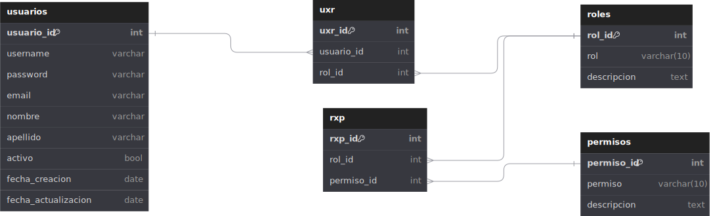

# Autenticación Modelado de Base de Datos

## Listado de Entidades

### usuarios **(ED)**

- usuario_id **(PK)**
- username **(UQ)**
- password
- email **(UQ)**
- nombre
- apellido
- avatar
- activo
- fecha_creacion
- fecha_actualizacion

### roles **(EC)**

- rol_id **(PK)**
- rol
- descripcion

### permisos **(EC)**

- permiso_id **(PK)**
- permiso
- descripcion

### roles_x_usuario **(EP)**

- rxu_id **(PK)**
- rol_id **(FK)**
- usuario_id **(FK)**

### permisos_x_roles **(EP)**

- pxr_id **(PK)**
- rol_id **(FK)**
- permiso_id **(FK)**

## Relaciones entre entidades

1. **usuarios** tiene **roles** (_N - M_).
1. **roles** tiene **permisos** (_N - M_).

