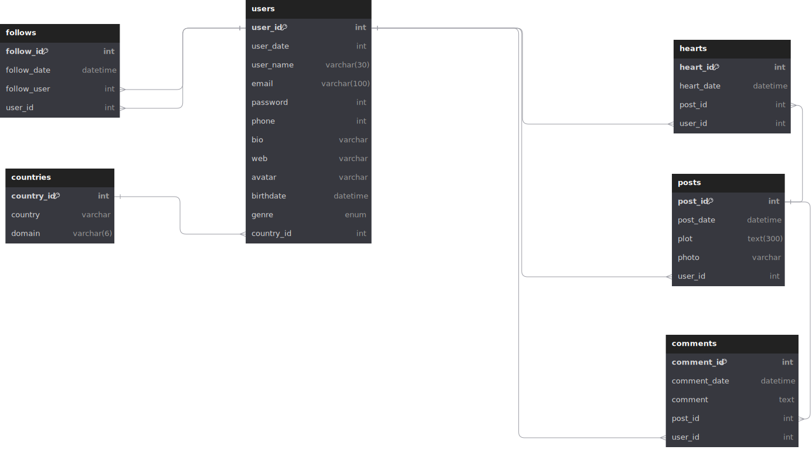

# Instagram

## Listado de Entidades

### users **(ED)**

- user **(PK)**
- user_date
- user_name
- email **(UQ)**
- password
- phone **(UQ)**
- bio
- web
- avatar
- birthdate
- genre
- coutry **(FK)**

### posts **(ED | EP)**

- post_id
- post_date
- plot
- photo
- user **(FK)**

### comments **(ED | EP)**

- comment_id **(PK)**
- comment_date
- comment
- post_id **(FK)**
- user **(FK)**

### hearts **(ED | EP)**

- heart_id **(PK)**
- heart_date
- post_id **(FK)**
- user **(FK)**

### follows **(ED | EP)**

- follow_id **(PK)**
- follow_date
- follow_user **(FK)**
- user **(FK)**

### countries **(EC)**

- country_id **(PK)**
- country

## Relaciones entre Entidades

1. **users** publica **posts** (_1 - M_)
1. **users** escriben **comments** (_1 - M_)
1. **posts** escribe **comments** (_1 - M_)
1. **users** otorgan **heart** (_1 - 1_)
1. **posts** tienen **heart** (_1 - M_)
1. **users** tienen **follows** (_1 - M_)
1. **users** siguen **follows** (_1 - M_)
1. **users** tienen **country** (_1 - M_)

