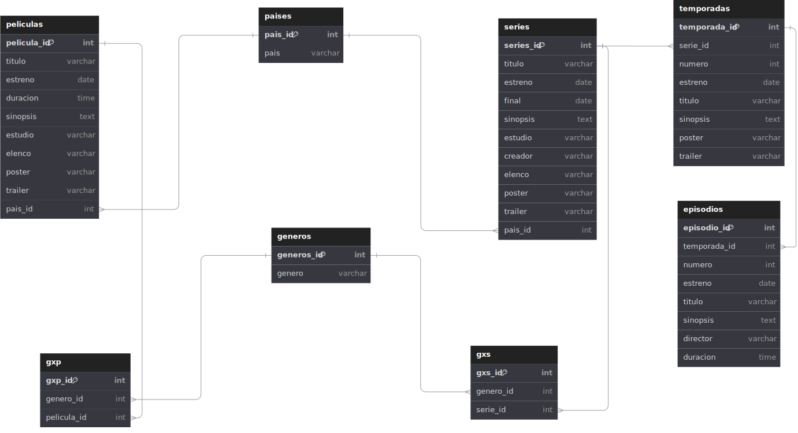

# PeliSeries DB

## Entidades

### Peliculas **(ED)**

- pelicula_id **(PK)**
- titulo
- estreno
- duracion
- sinopsis
- estudio <!--(nota: Esto puede ser una relacion de muchos a muchos pero consideramos uno solo)
- director <!-- (tambien consideramos aca que un director tiene una sola pelicula)
- elenco 
- poster
- trailer
- pais **(FK)**

### series

- series_id **(PK)**
- titulo
- estreno
- final
- sinopsis
- estudio
- creador
- elenco
- poster
- trailer
- pais **(FK)**

### temporadas **(ED | EP)**

- temporada_id **(PK)**
- serie_id **(FK)**
- numero
- estreno
- titulo
- sinopsis
- poster
- trailer

### episodios **(ED | EP)**

- episodio_id **(PK)**
- temporada_id **(FK)**
- numero
- estreno
- titulo
- sinopsis
- director
- duracion

### generos **(ED | EP)**

- genero_id **(PK)**
- nombre

### paises **(EC)**

- pais_id
- nombre

### generos_x_peliculas **(EP)**

- gxp_id **(PK)**
- genero_id **(FK)**
- pelicula_id **(FK)**

### generos_x_series **(EP)**

- gxs_id **(PK)**
- genero_id **(FK)**
- serie_id **(FK)**

## Relaciones Entre Entidades

1. Un **pais** tiene **peliculas** (_1 - M_).
1. Un **pais** tiene **series** (_1 - M_).
1. Una **serie** tiene **temporadas** (_1 - M_).
1. Una **temporada** tiene **episodios** (_1 - M_).
1. **generos** tienen **pelicuas** (_M - N_).
1. **generos** tienen **series** (_M - N_).

